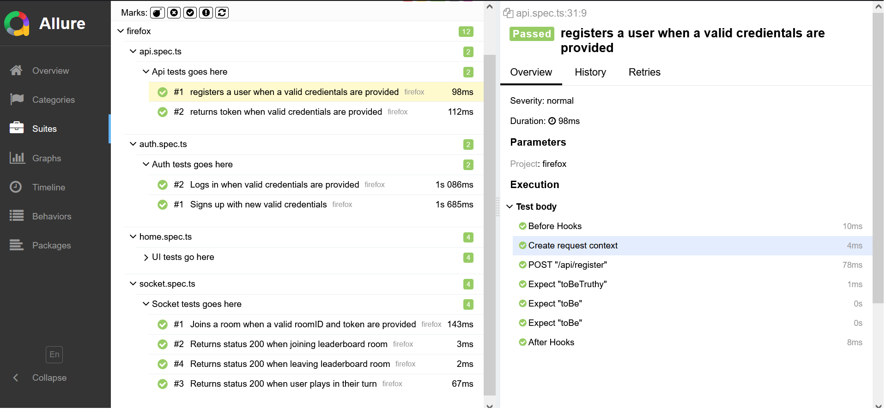
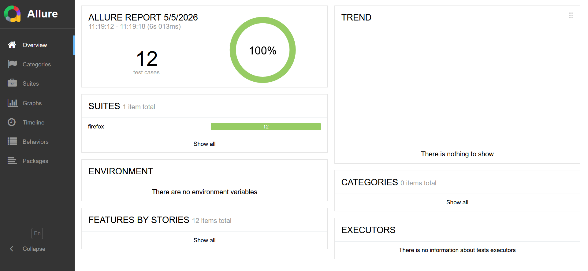
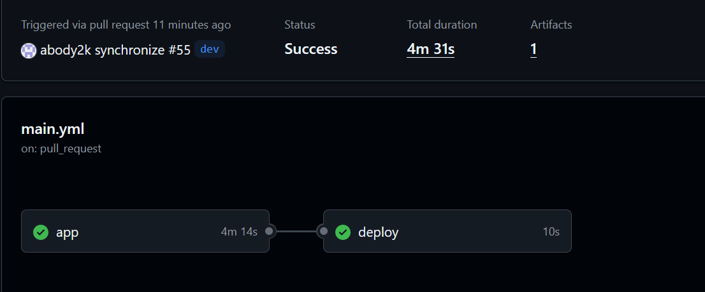

# Snake & Ladder Multiplayer Game

## Overview

This project is a full-stack, real-time Snake & Ladder game supporting both single-player (against AI) and multiplayer modes. It demonstrates modern web architecture with real-time communication, containerization, and automated testing.

The system is fully Dockerized, tested using Playwright, and designed with clear separation between frontend, backend, and game logic.

---

[](https://github.com/abody2k/snake-and-the-ladder/actions/workflows/main.yml)


## Tech Stack

**Frontend**

* SvelteKit
* Fetch API (HTTP communication)
* Socket.IO (real-time updates)

**Backend**

* Node.js (TypeScript)
* JWT-based authentication
* Argon2 password hashing

**Game Engine**

* Godot (exported to Web/HTML5 and embedded in frontend)

**Database**

* Redis (for sessions, leaderboard, and game state)

**Testing**

* Playwright (API + UI + WebSocket testing)
* Allure Reports

**Infrastructure**

* Docker (multi-stage builds)
* Docker Compose (development & production setups)

---

## Architecture

The application follows a clear separation of concerns:

* **Frontend (SvelteKit)** handles UI and user interaction.
* **Backend (Node.js)** manages:

  * Authentication
  * Game logic
  * Room management
  * Leaderboard updates
* **Game (Godot)** handles rendering and user gameplay interaction.
* **Redis** stores:

  * User sessions
  * Leaderboard data
  * Temporary game state

### Communication Strategy

* **HTTP (Fetch API)**
  Used for:

  * Authentication
  * Single-player gameplay
    → avoids unnecessary persistent connections

* **WebSockets (Socket.IO)**
  Used for:

  * Multiplayer synchronization
  * Real-time leaderboard updates
    → ensures all clients stay in sync

---

## Features

* User registration & login (JWT + Argon2)
* Single-player mode (AI/random dice logic)
* Multiplayer rooms with real-time synchronization
* Live leaderboard updates
* Fully containerized environment
* End-to-end testing (UI + API + sockets)

---

## Running the Project

### Development

```bash
docker compose -f compose.dev.yaml up --build
```

### Production

```bash
docker compose -f compose.production.yaml up --build
```

---

## Testing

Run Playwright tests:

```bash
cd test
npm install
npx playwright install
npx playwright test
```

Allure report:

```bash
allure generate allure-results --clean -o allure-report
```

---

## CI/CD

GitHub Actions pipeline:

* Installs dependencies
* Runs Playwright tests
* Builds Docker containers
* Generates test reports

---

## Screenshots / Demo






---

## What I Learned

* Designing real-time systems using WebSockets
* Efficient protocol selection (HTTP vs WebSockets)
* Structuring scalable backend architecture
* Dockerizing multi-service applications
* Writing end-to-end tests with Playwright
* Integrating a game engine (Godot) into a web application
* Managing state and performance using Redis

---

## Future Improvements

* Improve multiplayer edge-case handling
* Add animations and enhanced UI/UX
* Add matchmaking system
* Deploy to a cloud environment

---

## Author

Abdulrahman
